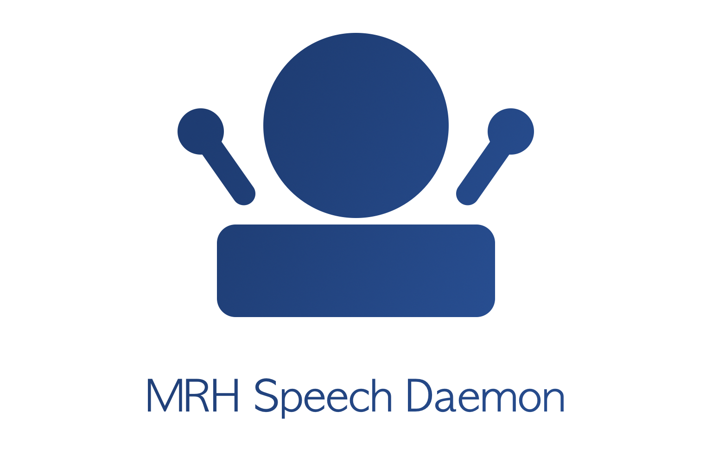

mrhspeechd
==========

   
The mrhspeechd project provides a standard speech input and output daemon to 
use with the MRH platform. Recording, playback and speech operations are 
handled by using third party libraries like SDL2 or the Google Cloud API to 
support as many configurations as possible.

.. toctree::
   :maxdepth: 2
   :caption: Contents:

   Building/Building
   Audio_Format/Audio_Format
   API_Providers/API_Providers
   Configuration_File/Configuration_File
   Signals/Signals
